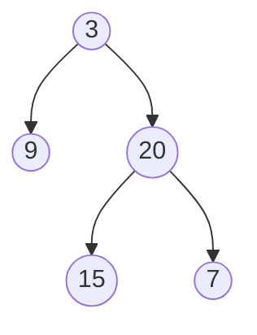

# Maximum Depth of Binary Tree

## **題目**
給一二元樹，請找出該樹的最大深度

-------------------------------------------

<b>回傳3</b>

## **解決思維**
網路上查解法，分成左右子樹，各自求深度，判斷哪個較深  
較深的那個再加上1；用遞迴的方式
## **程式碼**
* python
```python
    def maxDepth(self, root):
        """
        :type root: TreeNode
        :rtype: int
        """
        if(root is None):
            return 0
        else:
            left_depth = self.maxDepth(root.left)
            right_depth = self.maxDepth(root.right)
            
            if(left_depth>right_depth):
                return left_depth+1
            else:
                return right_depth+1
```
# **可能問題**
* 多複習資料結構，求深度是樹的基本函數
# **改良方法**