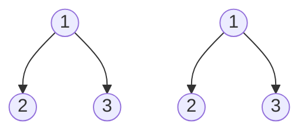

# Same Tree

## **題目**
給兩顆二元樹，比較兩者是否相同



## **解決思維**
如果現在的node存在，則比較兩者的值是否相同  
且利用遞迴傳各自的左子節點和右子節點進行比較

如果不同，回傳False，反之傳True

透過and，只要一有False，即可知道兩顆二元樹不一樣
## **程式碼**
* python
```python
    def isSameTree(p,q):
        if p and q:
            return p.val == q.val and isSameTree(p.left,q.left) and isSameTree(p.right,q.right)
            #這裡的p和q，是確定肯定不為None的
        return p is q 
        #關鍵點：如果是寫 return p.val == q.val，當 p 或是 q 為None  
        #則會發生錯誤(因為None沒有val這屬性)
```
# **可能問題**

# **改良方法**
